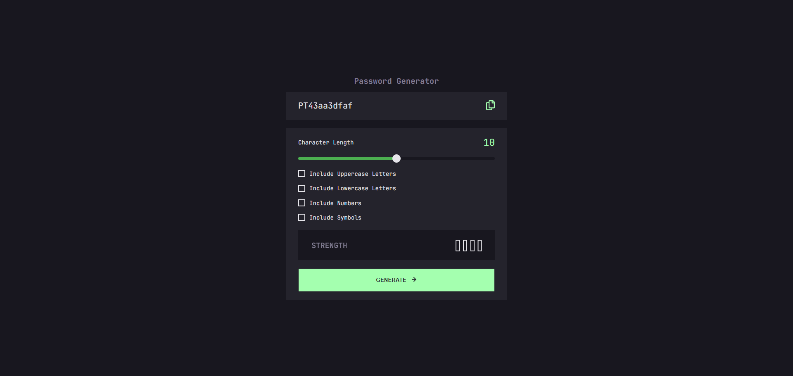

# pablodev | Password Generator

This is a solution to the [Password generator app challenge on Frontend Mentor](https://www.frontendmentor.io/challenges/password-generator-app-Mr8CLycqjh). Frontend Mentor challenges help you improve your coding skills by building realistic projects. 

### Notes of coder in PT-BR
*Como vai galera? neste desafio confesso que vi coisas que até então não tinha estilizado como por exemplo o botão checked ou até mesmo o input range (deu um certo trabalho) mas cá estamos aos trancos e barrancos.*

### Screenshot

### Links

- Solution URL: [Repositore](https://github.com/Pabloodev/password-generator)
- Live Site URL: [Live Server Site](https://pabloodev.github.io/password-generator/)

## My process

### What I learned

- Styling a range type input

- Style a checked button

- Improved JavaScript logic

## Author

- Website - [Pablo Teixeira Site](https://www.pabloteixeira.com)
- Frontend Mentor - [@pabloodev](https://www.frontendmentor.io/profile/pabloodev)
